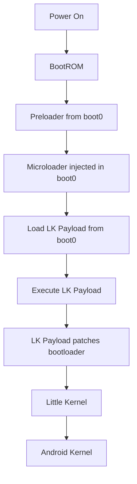

## Overview

The microloader is a tiny bootloader injected into the device's boot0 partition that runs during early boot. Its sole purpose is to load the [LK payload](/reference/lk-payload) from eMMC and execute it before the normal Little Kernel bootloader runs.

By using the microloader, the LK payload becomes persistent across reboots without requiring the bootrom exploit to be triggered each time.

## Purpose

The microloader solves a critical problem in the exploitation chain:

1. **Bootrom payloads are temporary**: Stage 1 and Stage 2 only run when the bootrom exploit is triggered
2. **LK modifications need persistence**: Boot-time patches must run on every boot
3. **Boot0 is read early**: The preloader reads from boot0 before loading LK
4. **Injection point**: By modifying boot0, we can inject code that runs before LK

The microloader acts as a trampoline, loading the full LK payload from a known location in boot0 and transferring control to it.

## Memory Layout

The microloader uses the same memory definitions as the LK payload:

```c
#define PAYLOAD_DST 0x41000000
#define PAYLOAD_SRC 0x80000
#define PAYLOAD_SIZE 0x80000

#define BOOT0_PART 1
#define BACKUP_SRC 0x200000
```

### Memory Locations

- **PAYLOAD_DST** (`0x41000000`): Where the LK payload is loaded into RAM
- **PAYLOAD_SRC** (`0x80000`): Primary storage location in boot0 (512KB offset)
- **BACKUP_SRC** (`0x200000`): Backup storage location in boot0 (2MB offset)
- **PAYLOAD_SIZE** (`0x80000`): Size of LK payload (512KB)

<Accordion title="Boot0 Partition Layout">
```
0x00000000: Preloader / bootloader
...
0x00080000: LK Payload (primary)
0x000FFFFF: End of primary payload
...
0x00200000: LK Payload (backup)
0x0027FFFF: End of backup payload
```
</Accordion>

## Implementation

The microloader is extremely simple, consisting of just the essential code to load and execute the payload:

```c
int main() {

    puts("microloader");

    struct device_t *dev = (void*)get_device();

    uint32_t *dst = (void*)PAYLOAD_DST;
    size_t ret = dev->read(dev, PAYLOAD_SRC, dst, PAYLOAD_SIZE, BOOT0_PART);


    if(*dst != 0xe3a0d442) {
        puts("Try backup");
        size_t ret = dev->read(dev, BACKUP_SRC, dst, PAYLOAD_SIZE, BOOT0_PART);
    }

    cache_clean(dst, PAYLOAD_SIZE);

    // Jump to the payload
    void (*jump)(void) = (void*)dst;
    puts("Jump");
    jump();

    while (1) {
        // Should never reach here
    }
}
```

## Execution Flow

### Step 1: Device Access

```c
struct device_t *dev = (void*)get_device();
```

Obtains a pointer to the device structure, which provides read/write access to eMMC partitions.

### Step 2: Load Primary Payload

```c
uint32_t *dst = (void*)PAYLOAD_DST;
size_t ret = dev->read(dev, PAYLOAD_SRC, dst, PAYLOAD_SIZE, BOOT0_PART);
```

Reads 512KB from boot0 at offset `0x80000` to RAM at `0x41000000`.

### Step 3: Verify and Fallback

```c
if(*dst != 0xe3a0d442) {
    puts("Try backup");
    size_t ret = dev->read(dev, BACKUP_SRC, dst, PAYLOAD_SIZE, BOOT0_PART);
}
```

Checks if the loaded payload is valid by verifying the first 4 bytes:
- **Magic value**: `0xe3a0d442` (ARM instruction: `mov sp, #0x42000000`)
- If invalid, loads from backup location at `0x200000`

<Note>
The magic value `0xe3a0d442` is the first instruction of the LK payload, which sets up the stack pointer.
</Note>

### Step 4: Cache Flush

```c
cache_clean(dst, PAYLOAD_SIZE);
```

Ensures the loaded payload is flushed from cache to main memory, preventing execution of stale data.

### Step 5: Execute Payload

```c
void (*jump)(void) = (void*)dst;
puts("Jump");
jump();

while (1) {
    // Should never reach here
}
```

Transfers execution to the loaded LK payload. The infinite loop is a safety measure that should never execute.

## UART Output

The microloader includes minimal UART support for debugging:

```c
void low_uart_put(int ch) {
    volatile uint32_t *uart_reg0 = (volatile uint32_t*)0x11003014;
    volatile uint32_t *uart_reg1 = (volatile uint32_t*)0x11003000;

    while ( !((*uart_reg0) & 0x20) )
    {}

    *uart_reg1 = ch;
}

int putchar(int character) {
    if (character == '\n')
        low_uart_put('\r');
    low_uart_put(character);
    return character;
}

int puts(const char *line) {
    for (const char *c = line; *c; ++c) {
        putchar(*c);
    }
    putchar('\n');
    return 0;
}
```

This allows the microloader to output diagnostic messages:
- `"microloader"`: Microloader has started
- `"Try backup"`: Primary payload invalid, trying backup
- `"Jump"`: About to execute the payload

## Installation

The microloader is installed by patching the boot0 partition:

### 1. Backup Original Boot0

```python
# Read entire boot0 partition
boot0 = device.read_partition(BOOT0_PART)
save_backup("boot0_original.bin", boot0)
```

### 2. Inject Microloader

```python
# Insert microloader at appropriate offset in boot0
boot0_modified = inject_microloader(boot0, microloader_binary)
```

### 3. Write LK Payload

```python
# Write LK payload to primary location
device.write_partition(BOOT0_PART, PAYLOAD_SRC, lk_payload)

# Write to backup location
device.write_partition(BOOT0_PART, BACKUP_SRC, lk_payload)
```

### 4. Write Modified Boot0

```python
# Write modified boot0 back
device.write_partition(BOOT0_PART, 0, boot0_modified)
```

<Warning>
Corrupting boot0 can brick the device. Always maintain backups and verify checksums before writing.
</Warning>

## Redundancy System

The microloader implements a simple redundancy system:

1. **Try primary**: Load payload from `PAYLOAD_SRC` (0x80000)
2. **Validate**: Check magic value `0xe3a0d442`
3. **Fallback**: If invalid, load from `BACKUP_SRC` (0x200000)
4. **Execute**: Jump to whichever payload was successfully loaded

This provides resilience against:
- Partial writes during payload updates
- Corruption of primary payload
- Power loss during payload installation

## Size Constraints

The microloader must be extremely small because:

1. **Boot0 space limited**: Must fit in available space without corrupting bootloader
2. **Early boot environment**: Limited memory and resources available
3. **Fast execution**: Should not significantly delay boot time

The current implementation is minimal:
- Simple UART output functions
- Single eMMC read operation
- Basic validation
- Direct jump to payload

## Device Structure

The microloader uses the same device structure as the LK payload:

```c
struct device_t {
    uint32_t unk1;
    uint32_t unk2;
    uint32_t unk3;
    uint32_t unk4;
    size_t (*read)(struct device_t *dev, uint64_t dev_addr, void *dst, uint32_t size, uint32_t part);
    size_t (*write)(struct device_t *dev, void *src, uint64_t block_off, uint32_t size, uint32_t part);
};

struct device_t* (*get_device)() = (void*)0x41E22ED1;
```

The `get_device()` function pointer is obtained from the bootloader environment.

## Source Code Location

The microloader implementation can be found at:
- **Main code**: `microloader/main.c`
- **Common definitions**: Shared with `lk-payload/common.h`

## Boot Process Integration



The microloader sits between the preloader and Little Kernel in the boot chain.

## Advantages

- **Persistent**: Survives reboots without re-exploitation
- **Fast**: Minimal overhead on boot time
- **Reliable**: Backup system prevents brick scenarios
- **Simple**: Small code footprint reduces bugs
- **Flexible**: Can load any payload, not just LK modifications

## Limitations

- **Boot0 required**: Must have write access to boot0 partition
- **Device-specific**: Memory addresses may vary by device/firmware
- **No verification**: Does not cryptographically verify payload
- **Single purpose**: Only loads and executes one payload

## Troubleshooting

### Microloader Not Executing

- Verify injection offset in boot0 is correct
- Check that preloader calls injected code
- Verify UART output if available

### Payload Not Loading

- Verify payload is at correct offset (`0x80000`)
- Check payload size is within `PAYLOAD_SIZE` (512KB)
- Verify magic value at start of payload

### Boot Loop

- Backup payload may be corrupted
- Try restoring original boot0 backup
- Re-write both primary and backup payloads

## Next Steps

After installing the microloader:

1. The [LK payload](/reference/lk-payload) will load automatically on every boot
2. LK payload will apply bootloader patches
3. Device will be in persistent modified state
4. Use MISC partition flags to control boot behavior
5. Access fastboot mode without button combinations
